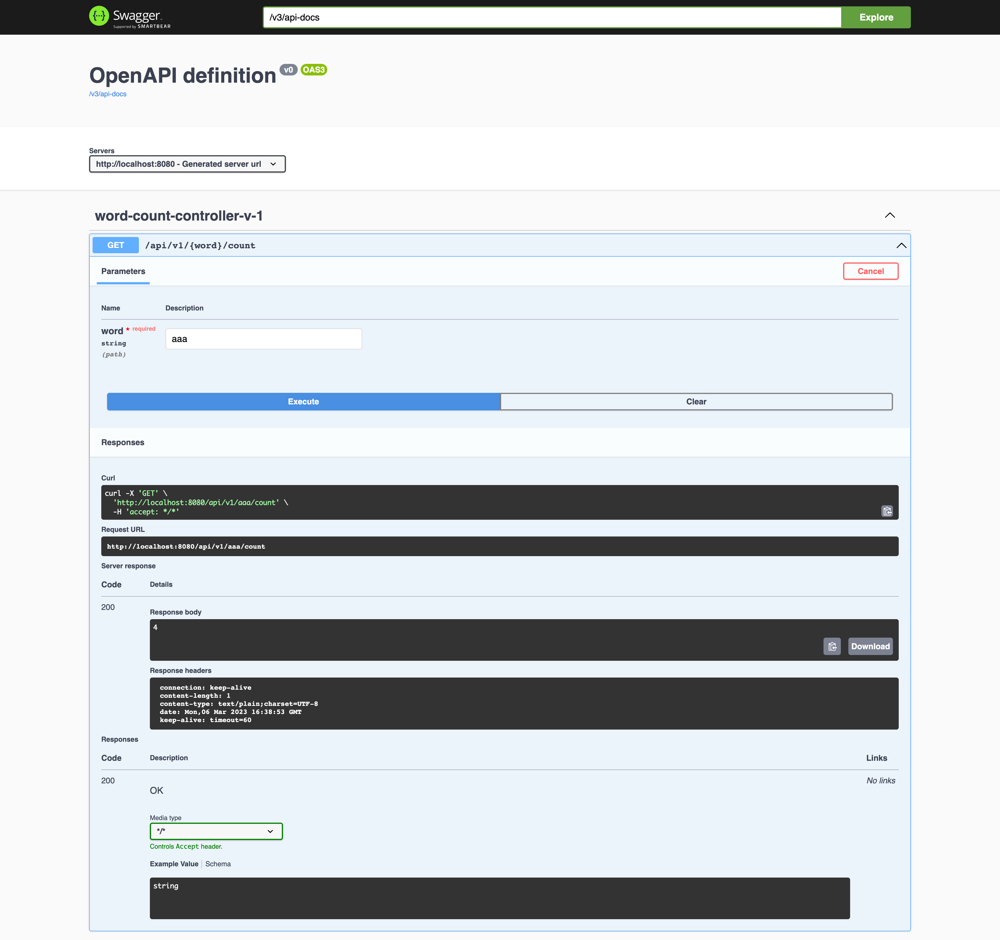

# NOTES

1. Application uses Spring Boot as it provides very useful controller annotations.

2. Apache Ignite is distributed memory cache with atomic operations, It supports persistence via jdbc. When configured, it will store values in the database (so data is not lost after all nodes are down).

3. Apache Ignite uses TCP multi-cast to find other nodes in the network. If deployed in Kubernetes it can use Kubernetes finder or S3-based finder if used on AWS.

4. ScalaTest does not work nicely with SpringRunner (which is used to test controller / service).

5. To open Swagger for api visit http://localhost:8080/swagger-ui/index.html#/word-count-controller-v-1/wordCount

